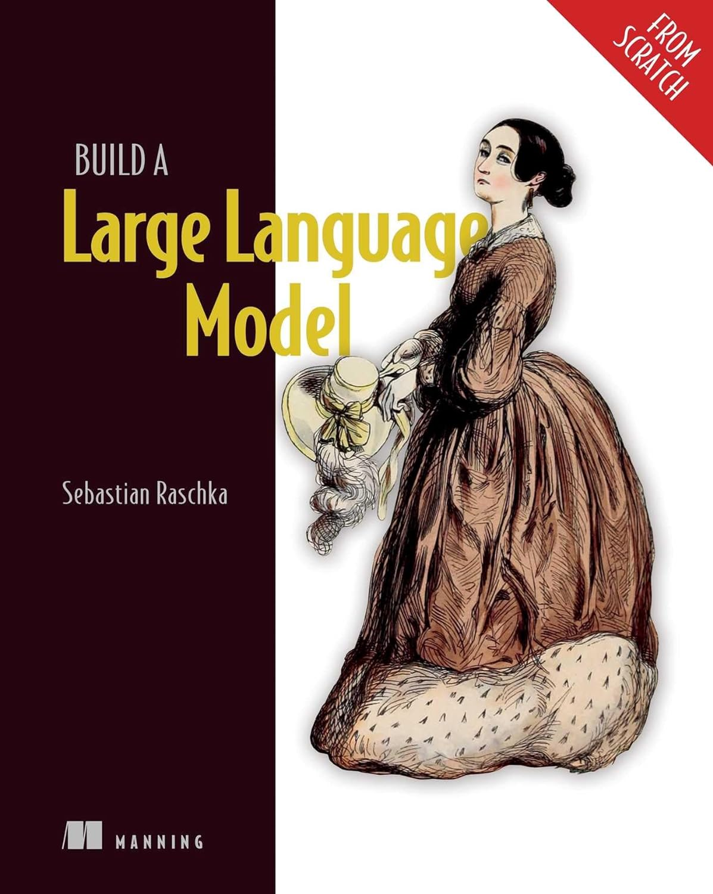

# Building a Large Language Model (_from scratch_)



<br>

📝 The project's objectives includes the following:

- End-to-End Pretraining Pipeline.

- A Working GPT-style Large Language Model.

- A classifier model.

- Functioning [Cli Support](#cli-support).

<br>

## Table of Contents

1. [Introduction](#introduction).
2. [Project Layout](#project-layout).
3. [Learning](#learning).
4. [Quickstart](#quickstart).
5. [Cli Support](#cli-support).
6. [Summary](#summary).

## Introduction

The original intent of this project was as a learning project and follow along to the book "**Build a Large Language Model (from scratch)** by _Sebastian Raschka_". However I decided to apply my knowledge from the book to build and finetune my own LLM built from scratch.

1. `learning/` contains all the learning materials and chapter code.

2. `small_llm/` contains the code of the final LLM product, and the LLM we will be training.

Depending on your purpose, you can skip to the whichever section suitable.

1. [Learning](#learning)
2. [Quickstart](#quickstart)

## Project Layout

- `learning/` contains the chapter notebooks and learning material.
- `small_llm/` contains the actual implementation.
- `scripts/` contains the main training commands.
- `artifacts/` stores saved model checkpoints.
- `data/` stores cached datasets.

## Learning

This section is all about the learning components that went into building this project, in the `learning` directory, you can view all the implementation details of each individual component.

Note that note all components in the learning phase made it to the final SLM

**Components:**

1. Tokenization
2. Embeddings Model
3. Multi-Head Self- Attention Mechanism
4. Transformer Block
5. Decoding Loop
6. Fine-tuned classifier
7. Fine-tuned personal assistant

## Quickstart

This section will give you all the commands necessary to start using the project, without wasting any time.

To get started with the project, simply run the following to download all dependencies:

```cmd
pip install -r requirements.txt
```

The following line will immediately begin the training process on the project gutenberg dataset:

```cmd
python scripts\train_gutenberg.py
```

To finetune the model:

```cmd
python scripts\finetune_chat.py
```

And finally, you can start the UI and communicate with the result of the model training:

```cmd
chainlit run app.py
```

The program should start running at your localhost, something like: `http://localhost:8000`

<br>

## CLI Support

I have added CLI support so you can communicate with your model through the command line interface. You can communicate with the model at any point, even prior to training so you could see the differences as the model trains and learns patterns.

Run the following command from the projects base directory and the CLI will get started:

```cmd
python scripts\chat_cli.py
```

### CLI Commands

The following is the list of supported CLI commands:

**General Purpose**

- `--help` prints out full list of supported commands
- `--chat` returns to chat page

**Architectural Commands**

- `--model-size`sets the gpt-2 model size (124M, 355M, ...)

- **Training Stage**

- `-resume` resumes the training from last checkpoint.
- `--epochs` set the number of epoch training (default = 3).
- `--save-freq` sets the checkpoint frequency (default = 500).

**Model Configuration**

- `--max-books [number of books]` sets the number of books to train the model on (0default = 1000).
  --max-books 1000 --epochs 3 --emb-dim 512 --n-heads 8 --n-layers 12 --batch-size 1
  <br>

## Summary
